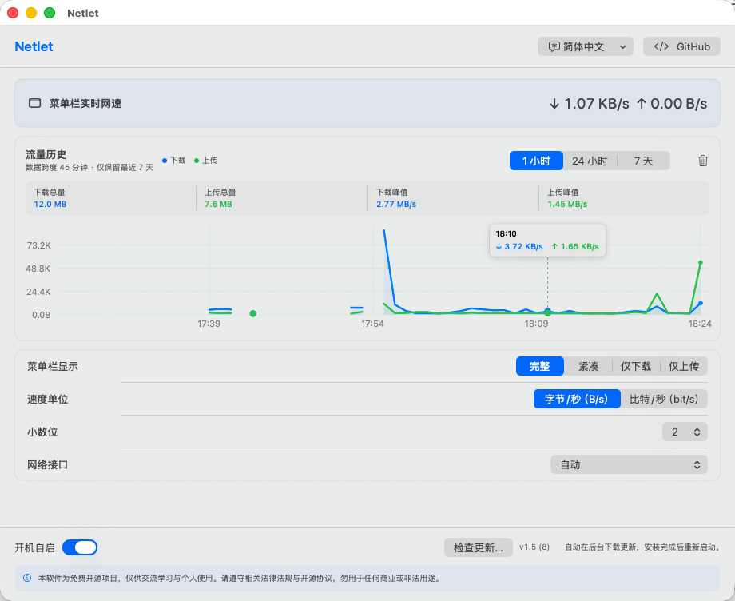
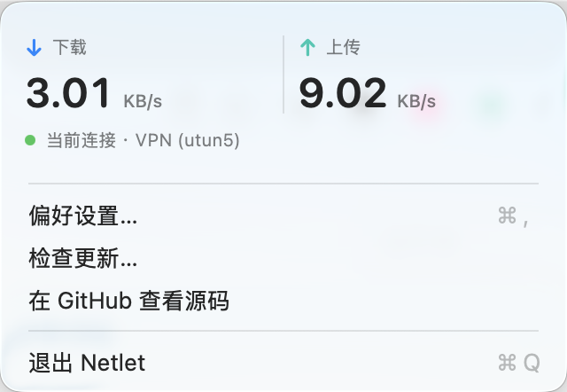

<p align="center">
  
</p>

<h1 align="center">Netlet</h1>

<p align="center"><strong>实时网速，一眼即知。</strong></p>

<p align="center">
  
  
  
  
  
</p>

<p align="center">
  <a href="https://hjingsuper.github.io/Netlet/">官方网站</a> ·
  <a href="https://github.com/hjingsuper/Netlet/releases/download/v1.7/Netlet-v1.7-Apple-Silicon.dmg">下载 DMG</a> ·
  <a href="https://github.com/hjingsuper/Netlet/releases">版本记录</a>
</p>

<p align="center">
  
</p>

<p align="center">
  
</p>

Netlet 是一款纯本地、单功能的 macOS 菜单栏实时网速工具。它读取系统网络接口的累计字节数，在本机计算上传和下载速率；不会检查网络内容，也不会上传任何数据。

## 功能

- 菜单栏实时显示下载与上传速度
- 菜单栏采用固定宽度与对齐槽位，实时数值和单位变化时不再左右跳动
- 完整、紧凑、仅下载、仅上传四种样式
- 字节/秒与比特/秒单位，可选择 0–2 位小数
- 单位自动换算，并通过切换迟滞避免在临界网速附近反复跳动
- 自动识别主要网络接口，也可手动指定
- 网速采集与实时数字固定每秒刷新；历史图表仅在可见时最多每 5 秒更新，打开或切换筛选立即更新
- 菜单关闭后释放图表视图，历史数据处理使用有界缓存，减少长期运行开销
- 最近 1 小时、24 小时和 7 天流量折线图；总量与峰值随筛选范围同步变化
- 主界面折线图支持鼠标悬停，显示对应分钟的下载与上传平均速度
- 菜单栏弹层读取同一份历史数据，并固定提供最近 1 小时的紧凑趋势
- 历史记录按分钟聚合，仅在本机保留最近 168 小时，可随时清除
- 开机自启、后台自动检查更新
- 简体中文与英文
- 睡眠唤醒、切换接口和计数器回退时安全重置

## 安装

1. 从 [Releases](https://github.com/hjingsuper/Netlet/releases) 下载 Apple Silicon DMG。
2. 打开 DMG，将 `Netlet.app` 拖到“应用程序”。
3. 首次打开若被 macOS 阻止，进入“系统设置 → 隐私与安全性”，找到 Netlet 并点击“仍要打开”。

项目目前没有 Apple Developer ID 证书，因此无法完成 Apple 公证；这不影响应用完全在本机运行。

## 隐私

Netlet 只读取 macOS 提供的网络接口累计字节数并在本机计算速度，不读取网络内容，也不上传任何网络数据。应用会将按分钟聚合的速度、流量总量与峰值保存到 `~/Library/Application Support/Netlet/history.sqlite`，数据只保留最近 7 天并可在主界面清除。除检查软件更新时连接 GitHub Releases 外，应用不会主动联网。

## 开发

```bash
swift test
./script/build_and_run.sh --verify
```

项目采用 Swift Package Manager，要求 macOS 14+ 与 Swift 6 工具链。

## 声明

本软件为免费开源项目，仅供交流学习与个人使用。请遵守相关法律法规与开源协议，勿用于任何商业或非法用途。

## License

[MIT](LICENSE)
